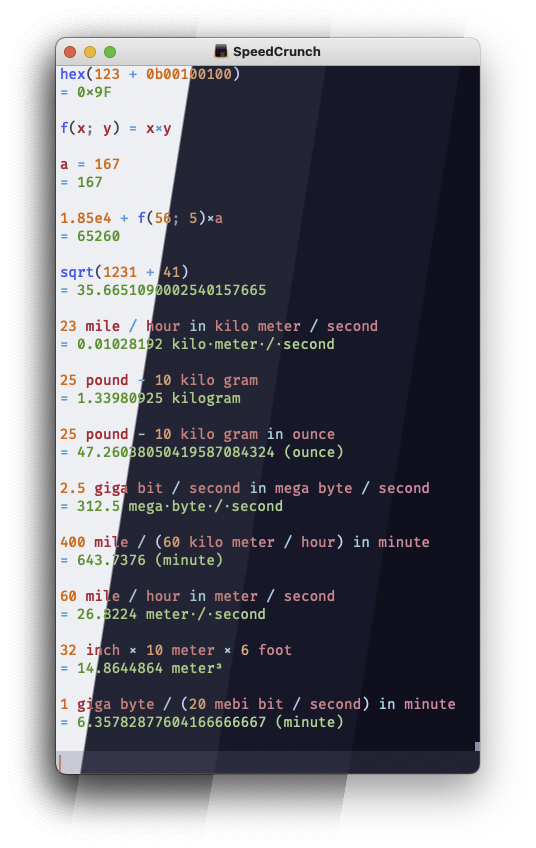
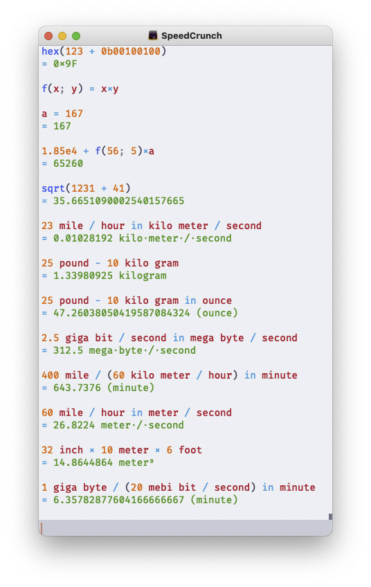
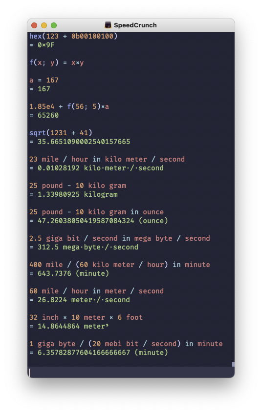
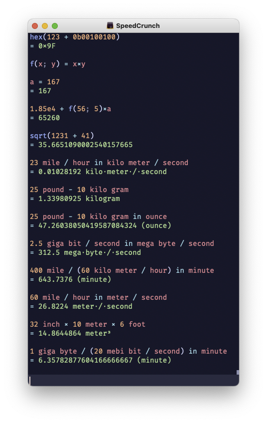
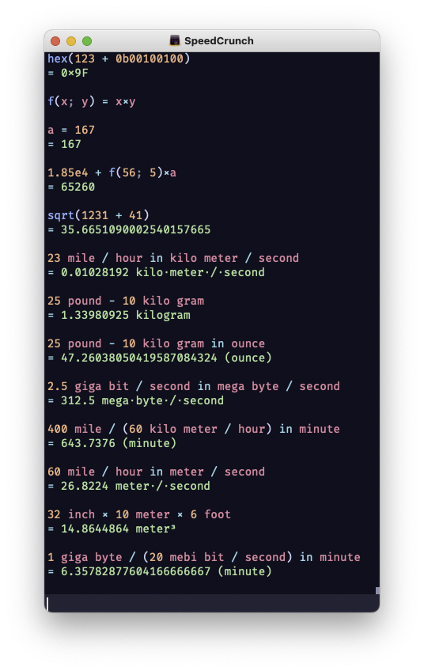

<h3 align="center">
	 
	
	Catppuccin for <a href="https://heldercorreia.bitbucket.io/speedcrunch/index.html">SpeedCrunch</a>
	
</h3>

	
	
	

## Previews

🌻 Latte

🪴 Frappé

🌺 Macchiato

🌿 Mocha

## Usage

1. Download your preferred flavor:

- 🌻 [Latte](./themes/Latte.json?raw=1)
- 🪴 [Frappe](./themes/Frappe.json?raw=1)
- 🌺 [Macchiato](./themes/Macchiato.json?raw=1)
- 🌿 [Mocha](./themes/Mocha.json?raw=1)

2. Copy the downloaded file to your color-schemes folder:

- Windows: C:/Users/<USERNAME>/AppData/Roaming/SpeedCrunch/color-schemes
- Linux/Unix: ~/.local/SpeedCrunch/color-schemes
- OS X: ~/Library/Application Support/SpeedCrunch/color-schemes
- When using a portable version of SpeedCrunch on any operating system, additional color schemes are loaded from the color-schemes subdirectory in the portable application directory.

3. Restart SpeedCrunch and select the theme in Settings -> Display -> Color Scheme.

## Ref:
https://heldercorreia.bitbucket.io/speedcrunch/advanced/colorschemeformat.html

## 💝 Thanks to

- [Zazucki](https://github.com/zazucki)

&nbsp;

	

	Copyright &copy; 2021-present <a href="https://github.com/catppuccin" target="_blank">Catppuccin Org</a>

	

